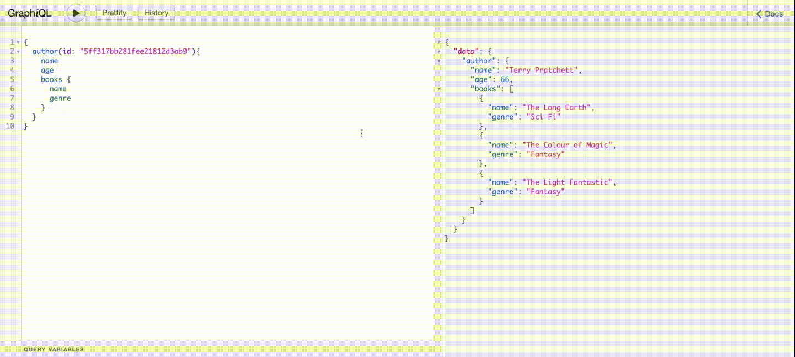

# How to Install and Run the app?

Node modules are not included in the course files. 

### Install

- git clone https://github.com/Boro23-wq/graphql-books-query.git (save it on your local drive)
- cd server && npm install (install server-side packages)
- cd client && npm install (install client-side packages)

## GraphQL Query Types

## Application Screen

